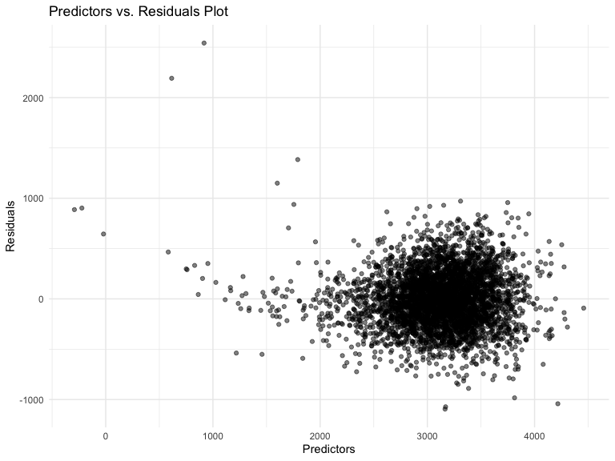
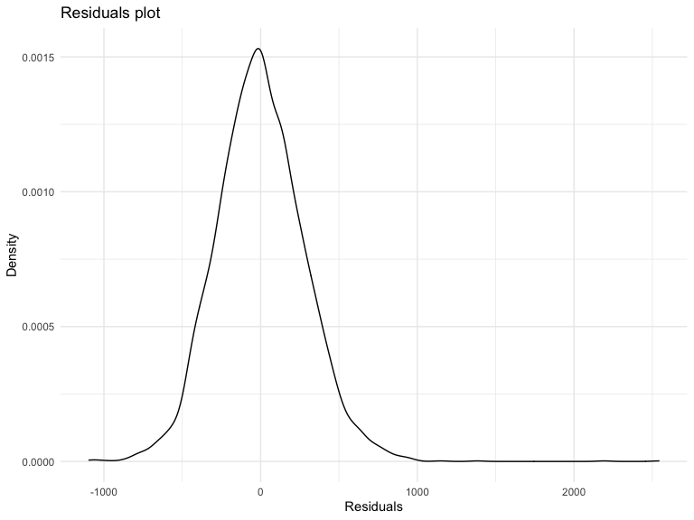
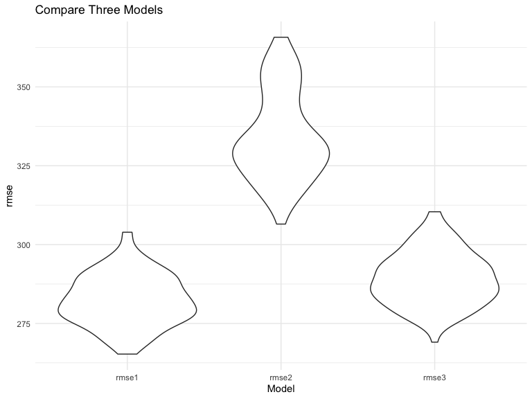

Homework 6
================
Zihan Yu

\#\#Problem 2

Load and clean the data for regression analysis

``` r
birthweight =
  read_csv(here::here("birthweight.csv")) %>%
  janitor::clean_names() %>%
  mutate(
    across(
      c("frace", "mrace"),
      ~ case_when(
        .x == 1 ~ "White",
        .x == 2 ~ "Black",
        .x == 3 ~ "Asian",
        .x == 4 ~ "Puero Rican",
        .x == 8 ~ "Other",
        .x == 9 ~ "Unknown"
      )
    ),
    across(where(is.character), as.factor),
    malform = case_when(malform == 0 ~ "absent",
                        malform == 1 ~ "present"),
    malform = as.factor(malform),
    babysex = case_when(babysex == 1 ~ "male",
                        babysex == 2 ~ "female") %>% as.factor()
  )
birthweight %>% skimr::skim_without_charts()
```

|                                                  |            |
| :----------------------------------------------- | :--------- |
| Name                                             | Piped data |
| Number of rows                                   | 4342       |
| Number of columns                                | 20         |
| \_\_\_\_\_\_\_\_\_\_\_\_\_\_\_\_\_\_\_\_\_\_\_   |            |
| Column type frequency:                           |            |
| factor                                           | 4          |
| numeric                                          | 16         |
| \_\_\_\_\_\_\_\_\_\_\_\_\_\_\_\_\_\_\_\_\_\_\_\_ |            |
| Group variables                                  | None       |

Data summary

**Variable type: factor**

| skim\_variable | n\_missing | complete\_rate | ordered | n\_unique | top\_counts                             |
| :------------- | ---------: | -------------: | :------ | --------: | :-------------------------------------- |
| babysex        |          0 |              1 | FALSE   |         2 | mal: 2230, fem: 2112                    |
| frace          |          0 |              1 | FALSE   |         5 | Whi: 2123, Bla: 1911, Pue: 248, Asi: 46 |
| malform        |          0 |              1 | FALSE   |         2 | abs: 4327, pre: 15                      |
| mrace          |          0 |              1 | FALSE   |         4 | Whi: 2147, Bla: 1909, Pue: 243, Asi: 43 |

**Variable type: numeric**

| skim\_variable | n\_missing | complete\_rate |    mean |     sd |     p0 |    p25 |    p50 |    p75 |   p100 |
| :------------- | ---------: | -------------: | ------: | -----: | -----: | -----: | -----: | -----: | -----: |
| bhead          |          0 |              1 |   33.65 |   1.62 |   21.0 |   33.0 |   34.0 |   35.0 |   41.0 |
| blength        |          0 |              1 |   49.75 |   2.72 |   20.0 |   48.0 |   50.0 |   51.0 |   63.0 |
| bwt            |          0 |              1 | 3114.40 | 512.15 |  595.0 | 2807.0 | 3132.5 | 3459.0 | 4791.0 |
| delwt          |          0 |              1 |  145.57 |  22.21 |   86.0 |  131.0 |  143.0 |  157.0 |  334.0 |
| fincome        |          0 |              1 |   44.11 |  25.98 |    0.0 |   25.0 |   35.0 |   65.0 |   96.0 |
| gaweeks        |          0 |              1 |   39.43 |   3.15 |   17.7 |   38.3 |   39.9 |   41.1 |   51.3 |
| menarche       |          0 |              1 |   12.51 |   1.48 |    0.0 |   12.0 |   12.0 |   13.0 |   19.0 |
| mheight        |          0 |              1 |   63.49 |   2.66 |   48.0 |   62.0 |   63.0 |   65.0 |   77.0 |
| momage         |          0 |              1 |   20.30 |   3.88 |   12.0 |   18.0 |   20.0 |   22.0 |   44.0 |
| parity         |          0 |              1 |    0.00 |   0.10 |    0.0 |    0.0 |    0.0 |    0.0 |    6.0 |
| pnumlbw        |          0 |              1 |    0.00 |   0.00 |    0.0 |    0.0 |    0.0 |    0.0 |    0.0 |
| pnumsga        |          0 |              1 |    0.00 |   0.00 |    0.0 |    0.0 |    0.0 |    0.0 |    0.0 |
| ppbmi          |          0 |              1 |   21.57 |   3.18 |   13.1 |   19.5 |   21.0 |   22.9 |   46.1 |
| ppwt           |          0 |              1 |  123.49 |  20.16 |   70.0 |  110.0 |  120.0 |  134.0 |  287.0 |
| smoken         |          0 |              1 |    4.15 |   7.41 |    0.0 |    0.0 |    0.0 |    5.0 |   60.0 |
| wtgain         |          0 |              1 |   22.08 |  10.94 | \-46.0 |   15.0 |   22.0 |   28.0 |   89.0 |

We fit a model in the following code. `bwt` is the outcome variable and
`babysex`, `bhead`, `blength`, `delwt`, `gaweeks` and `wtgain` are
predictors.

``` r
model_df <- birthweight %>%
  select(bwt, babysex, bhead, blength, delwt, gaweeks, wtgain)

mul_model = lm(bwt ~ ., data = model_df)
summary(mul_model)
```

    ## 
    ## Call:
    ## lm(formula = bwt ~ ., data = model_df)
    ## 
    ## Residuals:
    ##     Min      1Q  Median      3Q     Max 
    ## -1095.0  -183.4    -9.2   172.9  2541.8 
    ## 
    ## Coefficients:
    ##              Estimate Std. Error t value Pr(>|t|)    
    ## (Intercept) -6206.518     96.575  -64.27  < 2e-16 ***
    ## babysexmale   -32.511      8.715   -3.73  0.00019 ***
    ## bhead         137.171      3.529   38.87  < 2e-16 ***
    ## blength        78.821      2.067   38.13  < 2e-16 ***
    ## delwt           1.597      0.216    7.39  1.8e-13 ***
    ## gaweeks        13.169      1.495    8.81  < 2e-16 ***
    ## wtgain          2.204      0.435    5.06  4.3e-07 ***
    ## ---
    ## Signif. codes:  0 '***' 0.001 '**' 0.01 '*' 0.05 '.' 0.1 ' ' 1
    ## 
    ## Residual standard error: 282 on 4335 degrees of freedom
    ## Multiple R-squared:  0.698,  Adjusted R-squared:  0.698 
    ## F-statistic: 1.67e+03 on 6 and 4335 DF,  p-value: <2e-16

``` r
step(mul_model, direction = "backward")
```

    ## Start:  AIC=48988
    ## bwt ~ babysex + bhead + blength + delwt + gaweeks + wtgain
    ## 
    ##           Df Sum of Sq      RSS   AIC
    ## <none>                 3.44e+08 48988
    ## - babysex  1  1.10e+06 3.45e+08 49000
    ## - wtgain   1  2.03e+06 3.46e+08 49012
    ## - delwt    1  4.33e+06 3.48e+08 49041
    ## - gaweeks  1  6.15e+06 3.50e+08 49063
    ## - blength  1  1.15e+08 4.59e+08 50242
    ## - bhead    1  1.20e+08 4.63e+08 50284

    ## 
    ## Call:
    ## lm(formula = bwt ~ babysex + bhead + blength + delwt + gaweeks + 
    ##     wtgain, data = model_df)
    ## 
    ## Coefficients:
    ## (Intercept)  babysexmale        bhead      blength        delwt      gaweeks  
    ##     -6206.5        -32.5        137.2         78.8          1.6         13.2  
    ##      wtgain  
    ##         2.2

Model 1

``` r
model1 <- lm(bwt ~ ., data = model_df)
summary(model1)
```

    ## 
    ## Call:
    ## lm(formula = bwt ~ ., data = model_df)
    ## 
    ## Residuals:
    ##     Min      1Q  Median      3Q     Max 
    ## -1095.0  -183.4    -9.2   172.9  2541.8 
    ## 
    ## Coefficients:
    ##              Estimate Std. Error t value Pr(>|t|)    
    ## (Intercept) -6206.518     96.575  -64.27  < 2e-16 ***
    ## babysexmale   -32.511      8.715   -3.73  0.00019 ***
    ## bhead         137.171      3.529   38.87  < 2e-16 ***
    ## blength        78.821      2.067   38.13  < 2e-16 ***
    ## delwt           1.597      0.216    7.39  1.8e-13 ***
    ## gaweeks        13.169      1.495    8.81  < 2e-16 ***
    ## wtgain          2.204      0.435    5.06  4.3e-07 ***
    ## ---
    ## Signif. codes:  0 '***' 0.001 '**' 0.01 '*' 0.05 '.' 0.1 ' ' 1
    ## 
    ## Residual standard error: 282 on 4335 degrees of freedom
    ## Multiple R-squared:  0.698,  Adjusted R-squared:  0.698 
    ## F-statistic: 1.67e+03 on 6 and 4335 DF,  p-value: <2e-16

``` r
model1 %>% 
  broom::tidy() %>% 
  select(-std.error, -statistic) %>% 
  knitr::kable()
```

| term        | estimate | p.value |
| :---------- | -------: | ------: |
| (Intercept) | \-6206.5 |       0 |
| babysexmale |   \-32.5 |       0 |
| bhead       |    137.2 |       0 |
| blength     |     78.8 |       0 |
| delwt       |      1.6 |       0 |
| gaweeks     |     13.2 |       0 |
| wtgain      |      2.2 |       0 |

``` r
model_df <- model_df %>% 
  modelr::add_predictions(model1) %>% 
  modelr::add_residuals(model1)

model_df
```

    ## # A tibble: 4,342 x 9
    ##      bwt babysex bhead blength delwt gaweeks wtgain  pred  resid
    ##    <dbl> <fct>   <dbl>   <dbl> <dbl>   <dbl>  <dbl> <dbl>  <dbl>
    ##  1  3629 female     34      51   177    39.9     29 3349.  280. 
    ##  2  3062 male       34      48   156    25.9     28 2860.  202. 
    ##  3  3345 female     36      50   148    39.9     11 3459. -114. 
    ##  4  3062 male       34      52   157    40       30 3367. -305. 
    ##  5  3374 female     34      52   156    41.6     26 3410.  -36.2
    ##  6  3374 male       33      52   129    40.7     14 3159.  215. 
    ##  7  2523 female     33      46   126    40.3     21 2724. -201. 
    ##  8  2778 female     33      49   140    37.4     21 2945. -167. 
    ##  9  3515 male       36      52   146    40.3     41 3652. -137. 
    ## 10  3459 male       33      50   169    40.7     24 3087.  372. 
    ## # … with 4,332 more rows

In the graph, the dots are scattered around zero. There are a few
outliers in the graph.

``` r
model_df %>% 
  ggplot(aes(x = pred, y = resid)) +
  geom_point(alpha = 0.5) +
  labs(
    title = "Predictors vs. Residuals Plot",
    x = "Predictors",
    y = "Residuals"
  )
```



The density plot is relatively symmetric and residuals seem to be
centered around zero.

``` r
model_df %>% 
  ggplot(aes(x = resid)) +
  geom_density() +
  labs(
    title = "Residuals plot",
    x = "Residuals",
    y = "Density"
  )
```



Create other two models

``` r
model2 <- lm(bwt ~ blength + gaweeks, data = birthweight)
summary(model2)
```

    ## 
    ## Call:
    ## lm(formula = bwt ~ blength + gaweeks, data = birthweight)
    ## 
    ## Residuals:
    ##    Min     1Q Median     3Q    Max 
    ##  -1710   -215    -11    208   4189 
    ## 
    ## Coefficients:
    ##             Estimate Std. Error t value Pr(>|t|)    
    ## (Intercept) -4347.67      97.96   -44.4   <2e-16 ***
    ## blength       128.56       1.99    64.6   <2e-16 ***
    ## gaweeks        27.05       1.72    15.7   <2e-16 ***
    ## ---
    ## Signif. codes:  0 '***' 0.001 '**' 0.01 '*' 0.05 '.' 0.1 ' ' 1
    ## 
    ## Residual standard error: 333 on 4339 degrees of freedom
    ## Multiple R-squared:  0.577,  Adjusted R-squared:  0.577 
    ## F-statistic: 2.96e+03 on 2 and 4339 DF,  p-value: <2e-16

``` r
model2 %>% 
  broom::tidy() %>% 
  select(-std.error, -statistic) %>% 
  knitr::kable()
```

| term        | estimate | p.value |
| :---------- | -------: | ------: |
| (Intercept) |   \-4348 |       0 |
| blength     |      129 |       0 |
| gaweeks     |       27 |       0 |

``` r
model3 <- lm(bwt ~ babysex * bhead * blength, data = birthweight)
summary(model3)
```

    ## 
    ## Call:
    ## lm(formula = bwt ~ babysex * bhead * blength, data = birthweight)
    ## 
    ## Residuals:
    ##     Min      1Q  Median      3Q     Max 
    ## -1133.0  -190.4   -10.3   178.6  2618.0 
    ## 
    ## Coefficients:
    ##                            Estimate Std. Error t value Pr(>|t|)    
    ## (Intercept)                -801.949   1102.308   -0.73  0.46695    
    ## babysexmale               -6374.868   1677.767   -3.80  0.00015 ***
    ## bhead                       -16.598     34.092   -0.49  0.62639    
    ## blength                     -21.646     23.372   -0.93  0.35442    
    ## babysexmale:bhead           198.393     51.092    3.88  0.00010 ***
    ## babysexmale:blength         123.773     35.119    3.52  0.00043 ***
    ## bhead:blength                 3.324      0.713    4.67  3.2e-06 ***
    ## babysexmale:bhead:blength    -3.878      1.057   -3.67  0.00025 ***
    ## ---
    ## Signif. codes:  0 '***' 0.001 '**' 0.01 '*' 0.05 '.' 0.1 ' ' 1
    ## 
    ## Residual standard error: 288 on 4334 degrees of freedom
    ## Multiple R-squared:  0.685,  Adjusted R-squared:  0.684 
    ## F-statistic: 1.35e+03 on 7 and 4334 DF,  p-value: <2e-16

``` r
model3 %>% 
  broom::tidy() %>% 
  select(-std.error, -statistic) %>% 
  knitr::kable()
```

| term                      |  estimate | p.value |
| :------------------------ | --------: | ------: |
| (Intercept)               |  \-801.95 |   0.467 |
| babysexmale               | \-6374.87 |   0.000 |
| bhead                     |   \-16.60 |   0.626 |
| blength                   |   \-21.65 |   0.354 |
| babysexmale:bhead         |    198.39 |   0.000 |
| babysexmale:blength       |    123.77 |   0.000 |
| bhead:blength             |      3.32 |   0.000 |
| babysexmale:bhead:blength |    \-3.88 |   0.000 |

Cross Validation

``` r
cv =
  crossv_mc(birthweight, 100) %>% 
  mutate(
    train = map(train, as_tibble),
    test = map(test, as_tibble)
  )
cv_birthweight =
  cv %>% 
    mutate(
        model1 = map(train, ~lm(bwt ~ babysex + bhead + blength + delwt + gaweeks + wtgain, data = .x)),
        model2 = map(train, ~lm(bwt ~ blength + gaweeks, data = .x)),
        model3 = map(train, ~lm(bwt ~ bhead * blength * babysex, data = .x))
    ) %>% 
    mutate(
        rmse1 = map2_dbl(model1, test, ~rmse(model = .x, data = .y)),
        rmse2 = map2_dbl(model2, test, ~rmse(model = .x, data = .y)),
        rmse3 = map2_dbl(model3, test, ~rmse(model = .x, data = .y))
    )
```

Compare three models. Model1 has lowest RMSE, so it fits the data best.
Model2 has obviously highest RMSE, so it is the worst out of three
models.

``` r
cv_birthweight %>% 
  select(starts_with("rmse")) %>% 
  pivot_longer(
    everything(),
    names_to = "model",
    values_to = "rmse",
    names_prefix = "rmse_"
  ) %>% 
  ggplot(aes(x = model, y = rmse)) +
  geom_violin() +
  labs(
    title = "Compare Three Models",
    x = "Model",
    y = "rmse"
  )
```


